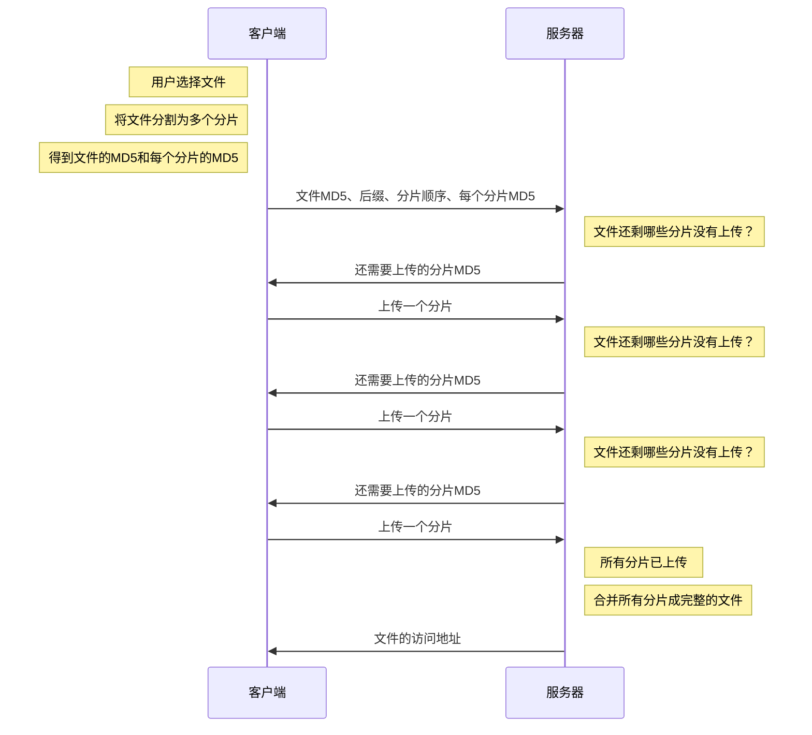

整体来说，实现断点上传的主要思路就是把要上传的文件切分为多个小的数据块然后进行上传  
  


下面用一种极其简易的流程实现分片上传  
  


客户端需要的是
1. 计算上传文件的md5和分割文件（注意，这边分块之后的文件一般是没有后缀的）
2. 对于分割的块进行md5计算
3. 将上传的**文件md5和分片文件md5和文件后缀**上传到后端服务器
4. 后端服务器检查是否有该md5文件的信息，有则检查其已上传的块 返回前端
5. 前端再把未上传的块上传到后端
6. 后端拿到所有块之后进行合并

这个流程中，前端到后端首先需要握手(handshake)，
前端根据后端所缺的块进行上传(uploadChunk)
后端拼接文件

对于文件分片，可以使用web worker实现多线程以提升性能
或者使用webAssembly

对于上传分片文件可以设计队列，控制并发请求服务器的数量，减少对服务器的压力


## 1.前端文件分片


```js
/**  
 * 对文件进行分片操作  
 * @param file  
 * @returns {Promise<{  
 *     fileId: string,  
 *     ext: string,  
 *     chunks:Blob[],  
 *     time:number  
 * }>}  
 */  
async function spiltFile(file) {  
    return new Promise((resolve) => {  
        /**  
         * 读取下一个分片  
         */  
        function loadNext() {  
            const start = chunkIndex * chunkSize,  
                end = start + chunkSize >= file.size ? file.size : start + chunkSize;  
            fileReader.readAsArrayBuffer(file.slice(start, end));  
        }  
  
        /**  
         * 获取文件的后缀名  
         * @param filename  
         */  
        function extName(filename) {  
            const i = filename.lastIndexOf('.');  
            if (i < 0) {  
                return '';  
            }  
            return filename.substr(i);  
        }  
  
        const currentTime = new Date().getTime();  
        // 分片尺寸（5M）  
        const chunkSize = 1024 * 1024 * 5;  
        // 分片数量  
        const chunkCount = Math.ceil(file.size / chunkSize);  
        // 当前chunk的下标  
        let chunkIndex = 0;  
        // 使用ArrayBuffer完成文件MD5编码  
        const spark = new SparkMD5.ArrayBuffer();  
        const fileReader = new FileReader(); // 文件读取器  
        const chunks = []; // 分片信息数组  
        // 读取第一个分片  
        loadNext()  
        // 读取一个分片后的回调  
        fileReader.onload = function (e) {  
            spark.append(e.target.result) // 分片数据追加到MD5编码器中  
            // 当前分片单独的MD5  
            const chunkMD5 = SparkMD5.ArrayBuffer.hash(e.target.result) + chunkIndex;  
            chunkIndex++;  
            chunks.push({  
                id: chunkMD5,  
                content: new Blob([e.target.result])  
            });  
            if (chunkIndex < chunkCount) {  
                loadNext(); // 继续读取下一个分片  
            } else {  
                // 读取完成  
                const fileId = spark.end();  
                const endTime = new Date().getTime();  
                resolve({  
                    fileId,  
                    ext: extName(file.name),  
                    chunks,  
                    time: endTime - currentTime  
                })  
            }  
        }  
    })  
}
```

