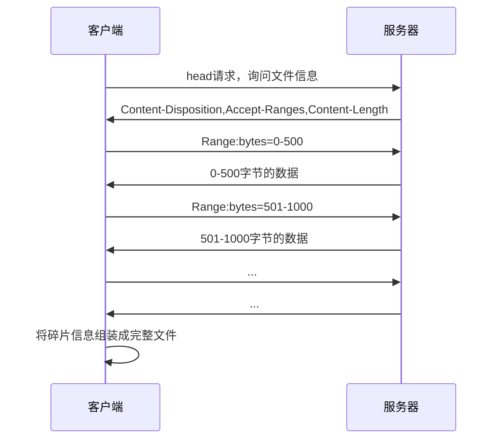
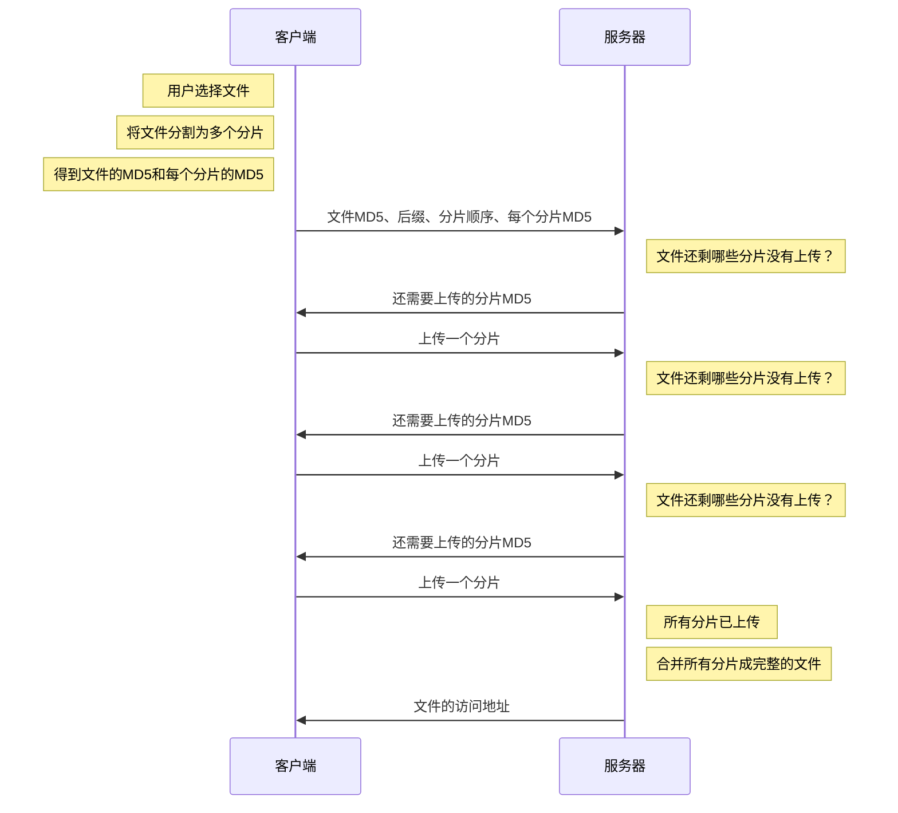

# 下载

若要实现下载时的断点续传，首先，服务器在响应时，要在头中加入下面的字段

```
Accept-Ranges: bytes
```

这个字段是向客户端表明：我这个文件可以支持传输部分数据，你只需要告诉我你需要的是哪一部分的数据即可，单位是字节

此时，某些支持断点续传的客户端，比如迅雷，它就可以在请求时，告诉服务器需要的数据范围。具体做法是在请求头中加入下面的字段

```
range: bytes=0-5000
```

客户端告诉服务器：请给我传递0-5000字节范围内的数据即可，无须传输全部数据

完整流程如下



# 上传

整体来说，实现断点上传的主要思路就是把要上传的文件切分为多个小的数据块然后进行上传


虽然分片上传的整体思路一致，但它没有一个统一的、具体的标准，因此需要根据具体的业务场景制定自己的标准。

由于标准的不同，这也就意味着分片上传需要自行编写代码实现。

下面用一种极其简易的流程实现分片上传




# 示例服务器

## 下载

http://localhost:8000/download/Wallpaper1.jpg

http://localhost:8000/download/Wallpaper2.jpg

http://localhost:8000/download/Wallpaper3.jpg

http://localhost:8000/download/Wallpaper4.jpg

http://localhost:8000/download/Wallpaper5.jpg

http://localhost:8000/download/Wallpaper6.jpg

http://localhost:8000/download/Wallpaper7.jpg

http://localhost:8000/download/Wallpaper8.jpg

http://localhost:8000/download/Wallpaper9.jpg

http://localhost:8000/download/Wallpaper10.jpg

## 上传

### 文件信息协商

**请求路径**：/api/upload/handshake

**请求方法**：POST

**字段**：


| 字段名   | 含义                                      | 是否必须 |
| -------- | ----------------------------------------- | -------- |
| fileId   | 文件的MD5编码                             | 是       |
| ext      | 文件的后缀，例如：.jpg                    | 是       |
| chunkIds | 文件分片的编号数组，每个编号是一个MD5编码 | 是       |
|          |                                           |          |

**可能的响应**：

```js
{
	code: 0,
  msg: '',
  data: 'http://localhost:8000/upload/a32d18.jpg' // 服务器已有该文件，无须上传
}
```

```js
{
	code: 0,
  msg: '',
  data: ['md5-1', 'md5-2', 'md5-5'] // 服务器还需要上传的分片
}
```


**可能发生的失败响应**：

```js
{
	code: 403,
	msg: '请携带文件编号',
	data: null
}
```

### 分片上传

**请求路径**：/api/upload

**请求方法**：POST

**字段**：

| 字段名  | 含义                  | 是否必须 |
| ------- | --------------------- | -------- |
| file    | 分片的二进制数据      | 是       |
| chunkId | 分片的MD5编码         | 是       |
| fileId  | 分片所属文件的MD5编码 | 是       |
|         |                       |          |

**上传成功的响应**：

```js
{
	code: 0,
  msg: '',
  data: ['md5-2', 'md5-5'] // 服务器还需要上传的分片
}
```

**可能发生的失败响应**：

```js
{
	code: 403,
	msg: '请携带文件编号',
	data: null
}
```

